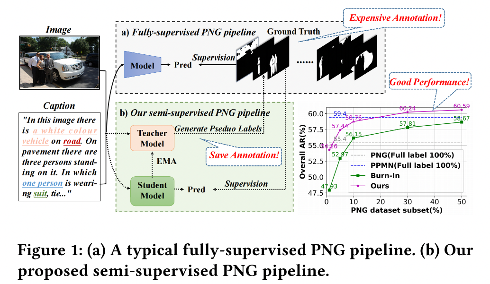

# SSPNG
The official implementation of the SSPNG paper in PyTorch.
## Semi-Supervised Panoptic Narrative Grounding

> Semi-Supervised Panoptic Narrative Grounding.
> Danni Yang, Jiayi Ji*, Xiaoshuai Sun, Haowei Wang, Yinan Li, Yiwei Ma, Rongrong Ji
> _ACM MM 2023_ (arvix)
## News
* [2023-08-3] Code is released.


## Abstract

> Despite considerable progress, the advancement of Panoptic Narrative Grounding (PNG) remains hindered by costly annotations. In this paper, we introduce a novel Semi-Supervised Panoptic Narrative Grounding (SS-PNG) learning scheme, capitalizing on a smaller set of labeled image-text pairs and a larger set of unlabeled pairs to achieve competitive performance. Unlike visual segmentation tasks, PNG involves one pixel belonging to multiple open-ended nouns. As a result, existing multi-class based semi-supervised segmentation frameworks cannot be directly applied to this task. To address this challenge, we first develop a novel SS-PNG Network (SS-PNG-NW) tailored to the SS-PNG setting. We thoroughly investigate strategies such as Burn-In and data augmentation to determine the optimal generic configuration for the SS-PNG-NW. Additionally, to tackle the issue of imbalanced pseudo-label quality, we propose a Quality-Based Loss Adjustment (QLA) approach to adjust the semi-supervised objective, resulting in an enhanced SS-PNG-NW+. Employing our proposed QLA, we improve BCE Loss and Dice loss at pixel and mask levels, respectively. We conduct extensive experiments on PNG datasets, with our SS-PNG-NW+ demonstrating promising results comparable to fully-supervised models across all data ratios. Remarkably, our SS-PNG-NW+ outperforms fully-supervised models with only 30% and 50% supervision data, exceeding their performance by 0.8% and 1.1% respectively. This highlights the effectiveness of our proposed SS-PNG-NW+ in overcoming the challenges posed by limited annotations and enhancing the applicability of PNG tasks. Source code is available in the supplementary materials.

## Installation

### Requirements

- Python
- Numpy
- Pytorch 1.10.0
- Tqdm
- Scipy 1.7.3

## Dataset Preparation

1. Download the 2017 MSCOCO Dataset from its [official webpage](https://cocodataset.org/#download). You will need the train and validation splits' images and panoptic segmentations annotations.

2. Download the Panoptic Narrative Grounding Benchmark from the PNG's [project webpage](https://bcv-uniandes.github.io/panoptic-narrative-grounding/#downloads). Organize the files as follows:

```
datasets
|_coco
    |_ train2017
    |_ val2017
    |_ panoptic_stuff_train2017
    |_ panoptic_stuff_val2017
    |_annotations
        |_ png_coco_train2017.json
        |_ png_coco_val2017.json
        |_ panoptic_segmentation
        |  |_ train2017
        |  |_ val2017
        |_ panoptic_train2017.json
        |_ panoptic_val2017.json
        |_ instances_train2017.json
```

3. Pre-process the Panoptic narrative Grounding Ground-Truth Annotation for the dataloader using [utils/pre_process.py](utils/pre_process.py).

4. At the end of this step you should have two new files in your annotations folder.
```
datasets
|_coco
    |_ train2017
    |_ val2017
    |_ panoptic_stuff_train2017
    |_ panoptic_stuff_val2017
    |_annotations
        |_ png_coco_train2017.json
        |_ png_coco_val2017.json
        |_ panoptic_segmentation
        |  |_ train2017
        |  |_ val2017
        |_ panoptic_train2017.json
        |_ panoptic_val2017.json
        |_ instances_train2017.json
        |_ png_coco_train2017_dataloader.json
        |_ png_coco_val2017_dataloader.json
```

## Train and Inference

### Pretrained Model


To reproduce all our results as reported in paper, you can use our pretrained model and our source code.

| Model | link |
| ----- | ---- |
| FPN   | [fpn](https://dl.fbaipublicfiles.com/detectron2/COCO-PanopticSegmentation/panoptic_fpn_R_101_3x/139514519/model_final_cafdb1.pkl)|
| Bert-base-uncased   | [bert](https://s3.amazonaws.com/models.huggingface.co/bert/bert-base-uncased.tar.gz)|
| SSPNG   | [sspng](https://drive.google.com/drive/folders/1dt81kTTiqqPe80hIuY-_ZJbX84A_3J0u?usp=drive_link)|


### Train
1. Modify the routes in [train.sh](train.sh) according to your local paths. 
2. Run train.sh
### Inference

Run test.sh to test the pretrained model, modify the pretrained model path `--ckpt_path`.
